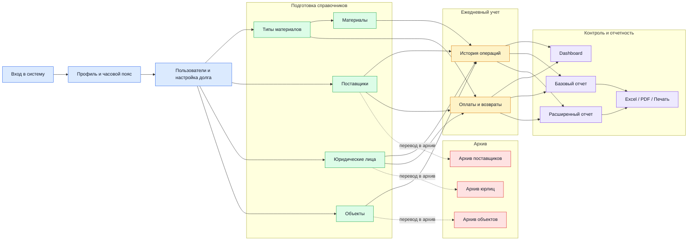

# Able CRM Concrete Accounting

Система для учета поставок материалов на объекты, фиксации оплат поставщикам и контроля задолженности по поставщикам и юридическим лицам.

Основная идея приложения:

- сначала заводятся справочники;
- потом фиксируются фактические операции по материалам;
- затем заносятся оплаты и возвраты;
- после этого данные анализируются на дашборде и в отчетах.

Коротко в одну строку:

`Единицы измерения и типы юрлиц -> типы материалов -> материалы -> поставщики / юрлица / объекты -> история операций -> оплаты -> отчеты`

## Визуальная карта действий



Важно: в текущем рабочем процессе используется один основной тип пользователя — `администратор`. Он ведет настройки, справочники, операции, оплаты и отчеты сам, без разделения на отдельные роли.

## Что можно сделать в системе

| Блок | Что можно сделать | Результат |
| --- | --- | --- |
| Авторизация | войти, выйти из системы | доступ к рабочим разделам и API |
| Профиль пользователя | изменить логин, email, пароль, аватар, часовой пояс | персонализированная работа пользователя |
| Администрирование | создавать, редактировать и удалять пользователей, менять demo-флаг, включать или выключать `Итог на конец года` | администратор управляет доступом и режимом учета |
| Типы материалов | создавать и редактировать типы материалов, задавать единицу измерения | база для создания материалов и платежей |
| Материалы | создавать, редактировать и искать материалы | справочник конкретных позиций для операций |
| Поставщики | создавать, редактировать, архивировать и восстанавливать поставщиков | контур аналитики по поставщикам |
| Юридические лица | создавать, редактировать, архивировать и восстанавливать юрлица | контур учета по плательщикам |
| Объекты | создавать, редактировать, искать, архивировать и восстанавливать объекты | привязка операций к стройплощадкам |
| История операций | создавать, редактировать и удалять операции, указывать подтвержденность, цену, объем, итог и комментарий | основной журнал движения материалов |
| Оплаты | создавать, редактировать и удалять оплаты и возвраты | учет закрытия долга перед поставщиком |
| Dashboard | смотреть долги и графики операций по датам | быстрый оперативный контроль |
| Базовый отчет | смотреть сводку `Взяли` и `Долг` | быстрый финансовый срез |
| Расширенный отчет | собирать выборки по фильтрам, сохранять фильтры, повторно использовать их | детальная аналитика по операциям |
| Экспорт | выгружать отчеты в Excel, PDF и печатать | внешняя отчетность и обмен данными |

Отдельно важно:

- в документации ниже основной сценарий описан для одного администратора, который ведет весь учет;
- часть действий во frontend зависит от флага `demo` у пользователя;
- для поставщиков, объектов и юрлиц используется мягкое удаление через архив;
- отчеты строятся на уже введенных операциях и оплатах, поэтому без операционных данных аналитика будет неполной.

## Что делает backend

Backend расположен в `backend/` и построен на `Yii2 + MariaDB`.

Он отвечает за:

- авторизацию пользователей и выдачу токена;
- хранение справочников и операционных данных;
- валидацию зависимостей между сущностями;
- расчет долгов и агрегатов для дашборда;
- построение базового и расширенного отчетов;
- сохранение пользовательских фильтров отчетов;
- управление пользователями, часовыми поясами, аватаром и настройками приложения.

Ключевые API-блоки:

- `AuthController` — вход и выход;
- `UsersController` — профиль и пользователи;
- `VendorsController`, `ObjectsController`, `MaterialsController`, `MaterialTypesController`, `LegalEntitiesController` — справочники;
- `HistoryOperationController` — учет операций по материалам;
- `PaymentsController` — оплаты и возвраты;
- `DashboardController` — сводка по долгам и графикам;
- `ReportController` — базовый и расширенный отчеты;
- `SettingsController`, `TimeController`, `FilesController` — служебные настройки.

## Что делает frontend

Frontend расположен в `frontend/` и построен на `Vue 3 + Vuex + Vue Router + Element Plus`.

Он отвечает за:

- экран авторизации;
- навигацию по разделам учета;
- формы создания и редактирования данных;
- пошаговый ввод операций по материалам;
- отображение задолженности, графиков и отчетов;
- экспорт отчетов в Excel/PDF и печать;
- настройки пользователя и административные настройки.

Основные разделы интерфейса:

- `Dashboard` — сводка по долгам и график операций;
- `История операций` — главный рабочий экран по учету материалов;
- `Оплата` — платежи и возвраты;
- `Поставщики`, `Объекты`, `Материалы`, `Типы материалов`, `Юридические лица` — справочники;
- `Отчеты` — базовый и расширенный анализ;
- `Настройки приложения` — часовой пояс, пользователи, переключатель итога на конец года;
- `Настройки пользователя` — профиль, пароль, аватар.

## Быстрый запуск

Проект запускается из корня репозитория:

```bash
docker compose up --build
```

После запуска доступны:

- frontend: `http://localhost:8050`
- backend API: `http://localhost:8020`
- база данных: `localhost:3306`

Дополнительно:

- backend автоматически прогоняет миграции при старте контейнера;
- production-конфиг frontend уже направлен на `http://localhost:8020`;
- после чистого разворачивания миграций создается пользователь `admin` с паролем `admin`.

## Основные сущности

| Сущность | От чего зависит | Для чего нужна |
| --- | --- | --- |
| `UnitsMeasurementVolume` | предзаполняется миграциями | единицы измерения для типов материалов |
| `LegalEntitiesTypes` | предзаполняется миграциями | типы юрлиц: `ООО`, `ИП` и т.д. |
| `MaterialTypes` | `UnitsMeasurementVolume` | группирует материалы и задает единицу измерения |
| `Materials` | `MaterialTypes` | конкретные материалы, которые участвуют в операциях |
| `Vendors` | опционально `Icons` | поставщики материалов |
| `LegalEntities` | `LegalEntitiesTypes` | юрлица, через которые учитываются операции и оплаты |
| `Objects` | без обязательных связей | стройплощадки или объекты, куда идут материалы |
| `HistoryOperation` | `Vendor + Material + LegalEntity + Object` | главный факт учета: что взяли, куда, по какой цене и на какую сумму |
| `Payments` | `Vendor + LegalEntity + MaterialType` | факт оплаты или возврата по поставщику |
| `Filters` | данные отчетов | сохраненные наборы условий для расширенных отчетов |
| `Settings.debt` | админская настройка | включает сценарий с пометкой `Долг на конец года` |
| `Users`, `Rights`, `Files`, `TimeZone` | служебные сущности | доступ, роли, аватар, персональный часовой пояс |

## Порядок заполнения данных

Это самый важный раздел для повседневной работы.

### 1. Войти в систему

Сначала пользователь авторизуется, получает токен и загружает свой профиль.

Зачем это нужно:

- без токена frontend не сможет работать с API;
- вместе с профилем подгружаются права, аватар, часовой пояс и режим доступа.

### 2. Проверить базовые настройки

Обычно первым делом стоит проверить:

- часовой пояс;
- список пользователей;
- настройку `Итог на конец года`, если в вашей схеме учета используется долг на конец года.

Зачем это нужно:

- время операций и платежей сохраняется в timestamp, поэтому важен корректный timezone;
- пользователи и права влияют на доступ к административным разделам;
- настройка долга влияет на форму создания операции.

### 3. Завести типы материалов

Раздел: `Типы материалов`.

Что добавляется:

- тип материала;
- единица измерения объема для этого типа.

Зачем это нужно:

- без типа материала нельзя завести конкретный материал;
- тип материала используется не только в материалах, но и в платежах.

### 4. Завести материалы

Раздел: `Материалы`.

Что добавляется:

- конкретные позиции материалов, каждая привязывается к типу материала.

Зачем это нужно:

- именно материал выбирается в истории операций;
- через тип материала система понимает, к какой группе относится операция.

### 5. Завести поставщиков

Раздел: `Поставщики`.

Что добавляется:

- карточка поставщика;
- при необходимости иконка для отображения в интерфейсе.

Зачем это нужно:

- поставщик является одной из главных осей учета;
- дашборд и отчеты строят аналитику именно по поставщикам.

### 6. Завести юридические лица

Раздел: `Юридические лица`.

Что добавляется:

- юрлицо;
- его тип, например `ООО` или `ИП`.

Зачем это нужно:

- операции и оплаты ведутся не просто по поставщику, а по связке `поставщик + юрлицо`;
- задолженность считается именно в этом разрезе.

### 7. Завести объекты

Раздел: `Объекты`.

Что добавляется:

- стройобъект или площадка, куда относится операция.

Зачем это нужно:

- без объекта нельзя создать историю операции;
- объект нужен для детализации движения материалов и фильтрации отчетов.

### 8. Вести историю операций

Раздел: `История операций`.

Это основной рабочий процесс приложения. Во frontend он оформлен как мастер из трех шагов.

Шаг 1. Основа:

- поставщик;
- тип материала;
- материал;
- плательщик.

Шаг 2. Детали:

- объект;
- объем;
- цена;
- итоговая сумма.

Шаг 3. Итог:

- дата операции;
- подтверждение данных;
- комментарий;
- при включенной настройке — флаг `Долг на конец года`.

Зачем это нужно:

- `HistoryOperation` — это главный факт учета в системе;
- именно из этих записей backend считает, сколько материалов было взято и на какую сумму;
- без операций дашборд и отчеты почти пустые.

### 9. Вести оплаты и возвраты

Раздел: `Оплата`.

Что добавляется:

- поставщик;
- юридическое лицо;
- тип материала;
- сумма;
- дата платежа;
- тип операции: обычная оплата или возврат.

Зачем это нужно:

- оплаты уменьшают долг перед поставщиком;
- возвраты учитываются отдельным типом операции;
- без платежей система покажет только объем взятого, но не закрытие задолженности.

### 10. Анализировать данные

Разделы: `Dashboard` и `Отчеты`.

Что происходит здесь:

- дашборд показывает текущие долги и график операций по датам;
- базовый отчет показывает агрегаты `Взяли` и `Долг`;
- расширенный отчет позволяет собирать выборки по поставщику, объекту, юрлицу, материалу, типу материала, цене, объему, итогу, датам и подтвержденности;
- фильтры можно сохранять и использовать повторно.

Зачем это нужно:

- это итоговый слой системы, который превращает введенные операции и оплаты в управленческую аналитику;
- данные можно экспортировать в Excel, PDF и отправлять на печать.

### 11. Архивировать, а не удалять рабочие справочники

Для поставщиков, объектов и юрлиц предусмотрен архив.

Зачем это нужно:

- история операций и аналитика опираются на старые записи;
- архив позволяет убрать сущность из активной работы, не ломая прошлый учет.

## Почему именно такой порядок

Порядок не случайный, он зашит и в зависимости backend, и в формах frontend.

- без `MaterialType` нельзя создать `Material`;
- без `Vendor`, `Material`, `LegalEntity` и `Object` нельзя создать `HistoryOperation`;
- без `Vendor`, `LegalEntity` и `MaterialType` нельзя создать `Payment`;
- без операций и оплат невозможно получить корректные долги на дашборде и в отчетах.

Во frontend это видно напрямую:

- в мастере создания операции поля открываются последовательно;
- выбор материала зависит от выбранного типа материала;
- платеж нельзя создать без поставщика, юрлица и типа материала;
- отчеты имеют смысл только после накопления операционных данных.

## Как считается долг

Логика backend сводится к следующему:

1. Суммируются все операции `HistoryOperation.total`.
2. Суммируются все оплаты `Payments.amount`.
3. Расчет идет по связке `поставщик + юридическое лицо`.
4. Формируется две основные метрики:
   - `Взяли` — сколько материалов принято в учет по операциям;
   - `Долг` — сколько осталось после вычета оплат.

Именно эти данные используются в `DashboardController` и `ReportController`.

## Карта разделов фронтенда

| Раздел | Что делает | Какие данные нужны |
| --- | --- | --- |
| `Dashboard` | показывает долги и график операций | операции и оплаты |
| `История операций` | создает и редактирует основной учетный факт | поставщики, материалы, юрлица, объекты |
| `Оплата` | фиксирует оплаты и возвраты | поставщики, юрлица, типы материалов |
| `Поставщики` | ведет список поставщиков и архив | иконки |
| `Объекты` | ведет объекты и поиск по ним | нет обязательных зависимостей |
| `Материалы` | ведет конкретные материалы | типы материалов |
| `Типы материалов` | ведет категории материалов | единицы измерения |
| `Юридические лица` | ведет плательщиков | типы юрлиц |
| `Отчеты` | строит аналитику и сохраняет фильтры | операции, оплаты, справочники |
| `Настройки приложения` | часовой пояс, пользователи, долг на конец года | права администратора для части вкладок |
| `Настройки пользователя` | профиль, пароль, аватар | авторизованный пользователь |

## Итоговый рабочий сценарий

Если описать приложение как единый процесс, то он выглядит так:

1. Администратор входит в систему.
2. Администратор при необходимости создает пользователей и настраивает режим работы.
3. Администратор готовит справочники.
4. Администратор ежедневно заносит операции по материалам.
5. Администратор заносит оплаты и возвраты.
6. Администратор смотрит дашборд и отчеты.
7. Администратор архивирует неактуальные справочники, а история продолжает участвовать в аналитике.

Именно в этом и состоит реальный флоу приложения: не просто хранить справочники, а провести данные от первичного учета материала до контроля задолженности и отчетности.
